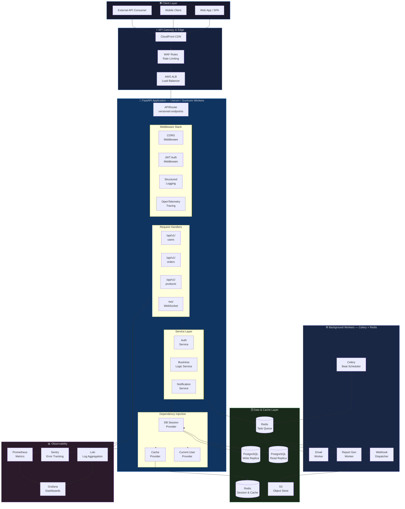
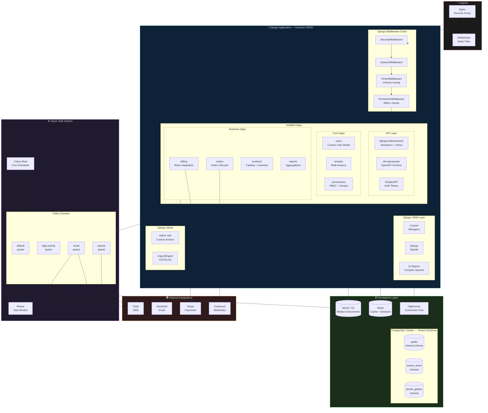
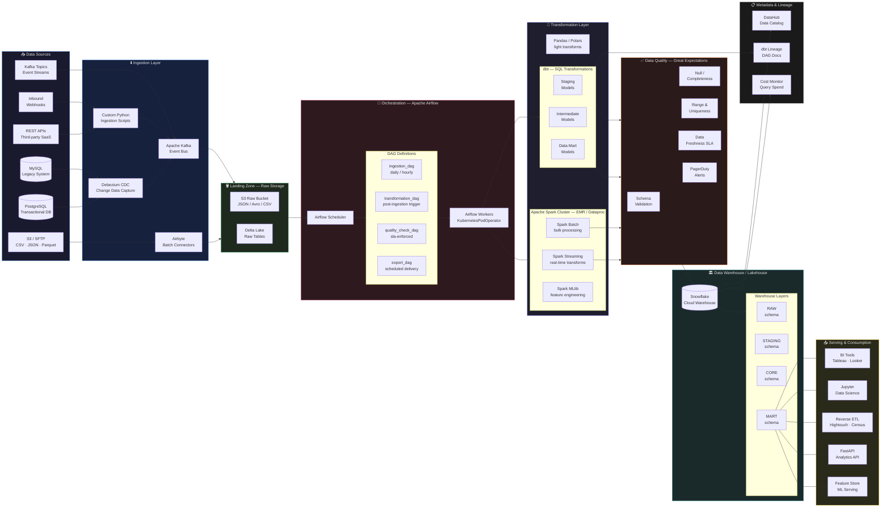
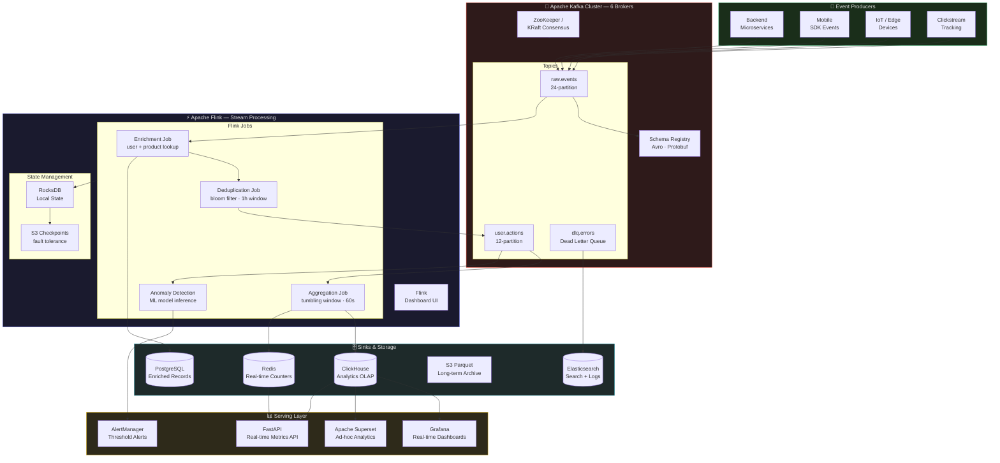
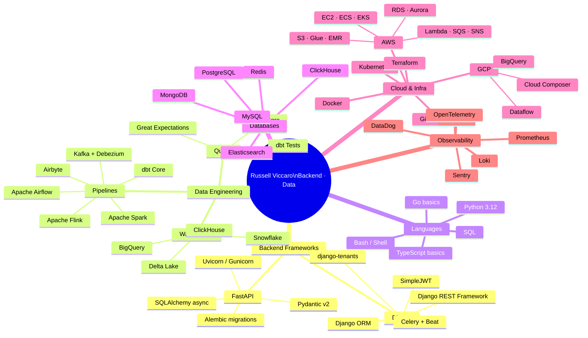

# Russell Viccaro
### Backend Engineer · Data Engineer
`FastAPI` · `Django` · `ETL Pipelines` · `Python`

---

## About Me

I'm a **Backend & Data Engineer** based in the United States, specializing in high-performance REST APIs, asynchronous microservices, and large-scale ETL/ELT data pipelines. I design systems that handle millions of events per day — from ingestion through transformation to analytical delivery — with a focus on reliability, observability, and clean architecture.

- 🔧 Building production APIs with **FastAPI** and **Django REST Framework**
- 🔄 Designing and operating **ETL / ELT pipelines** at scale (batch & streaming)
- ☁️ Cloud-native infrastructure on **AWS** and **GCP**
- 📊 Enabling data teams with warehouse-first architectures using **dbt**, **Airflow**, and **Spark**
- 🧪 Advocate for test-driven development, typed Python, and CI/CD automation

---

## Architecture Diagrams

### 1 · FastAPI Microservice Architecture

A production-grade FastAPI service with async request handling, JWT auth, Redis caching, background task processing, and PostgreSQL persistence.

---

### 2 · Django REST Framework — Multi-Tenant SaaS Backend

A Django-based SaaS backend with tenant isolation, role-based access control, async task queuing, and a pluggable app architecture.

---

### 3 · ETL / ELT Data Pipeline Architecture

An end-to-end data pipeline covering ingestion from multiple sources, transformation layers, quality checks, and serving to downstream consumers.

---

### 4 · Streaming Event Pipeline — Kafka + Flink + ClickHouse

A real-time streaming architecture for high-throughput event processing, aggregation, and analytics delivery with sub-second latency.

---

### 5 · Tech Stack Overview

---

## Technology Stack

### Languages & Runtimes

| Category | Technologies |
|---|---|
| **Primary** | Python 3.12, SQL (PostgreSQL dialect, BigQuery SQL, Snowflake SQL) |
| **Secondary** | Bash / Shell, Go (basics), TypeScript (basics) |
| **Python Ecosystem** | asyncio, typing, pydantic, dataclasses, mypy, black, ruff |

### Backend Frameworks

| Framework | Use Case | Key Libraries |
|---|---|---|
| **FastAPI** | Async REST APIs, microservices, ML serving endpoints | Uvicorn, Gunicorn, SQLAlchemy async, Alembic, Pydantic v2, python-jose, passlib |
| **Django** | Full-stack SaaS apps, admin-heavy platforms, multi-tenant systems | DRF, drf-spectacular, SimpleJWT, Celery, django-tenants, django-storages |
| **Flask** | Lightweight internal tools, simple webhook receivers | Flask-RESTful, Flask-SQLAlchemy |

### Data Engineering

| Layer | Technologies |
|---|---|
| **Orchestration** | Apache Airflow 2.x, Prefect, Dagster |
| **Batch Processing** | Apache Spark (PySpark), dbt Core, Pandas, Polars |
| **Stream Processing** | Apache Flink, Kafka Streams, Spark Structured Streaming |
| **Message Bus** | Apache Kafka, AWS SQS/SNS, Redis Streams |
| **CDC / Replication** | Debezium, AWS DMS, Airbyte |
| **Transformation** | dbt (staging → intermediate → marts), custom PySpark jobs |
| **Data Quality** | Great Expectations, dbt Tests, Soda Core |

### Databases & Storage

| Type | Technologies |
|---|---|
| **Relational** | PostgreSQL (primary), MySQL, SQLite (testing) |
| **OLAP / Warehouse** | Snowflake, Google BigQuery, ClickHouse, AWS Redshift |
| **Lakehouse** | Delta Lake, Apache Iceberg, AWS Glue Data Catalog |
| **Cache / KV** | Redis, Memcached |
| **Search** | Elasticsearch, OpenSearch |
| **Document** | MongoDB, DynamoDB |
| **Object Store** | AWS S3, GCS, MinIO |

### Cloud & Infrastructure

| Category | Technologies |
|---|---|
| **AWS** | EC2, ECS, EKS, RDS/Aurora, S3, Glue, EMR, Lambda, SQS, SNS, CloudWatch, IAM |
| **GCP** | BigQuery, Cloud Composer (Airflow), Dataflow, Cloud Run, GCS |
| **Containers** | Docker, Docker Compose, Kubernetes (EKS/GKE), Helm |
| **IaC** | Terraform, AWS CDK, CloudFormation |
| **CI/CD** | GitHub Actions, GitLab CI, ArgoCD, Jenkins |

### Observability & Monitoring

| Tool | Purpose |
|---|---|
| **Prometheus** | Metrics collection and alerting rules |
| **Grafana** | Dashboards — infrastructure, pipeline health, API latency |
| **Loki** | Log aggregation and querying |
| **Sentry** | Error tracking and performance monitoring |
| **OpenTelemetry** | Distributed tracing across microservices |
| **DataDog** | APM and full-stack observability (enterprise projects) |
| **Airflow UI / Flower** | Pipeline and task monitoring |

### API Design & Tooling

| Concern | Approach / Tool |
|---|---|
| **API Style** | REST (primary), GraphQL (selective), WebSocket (real-time) |
| **Documentation** | OpenAPI / Swagger (drf-spectacular, FastAPI native) |
| **Authentication** | JWT (SimpleJWT, python-jose), OAuth2, API Keys |
| **Rate Limiting** | Redis-backed token bucket, slowapi (FastAPI) |
| **Serialization** | Pydantic v2, DRF Serializers, marshmallow |
| **Testing** | pytest, pytest-asyncio, factory_boy, Hypothesis, httpx |

---

## Featured Projects

### 🚀 High-Throughput Event Ingestion Pipeline
Kafka → Flink → ClickHouse pipeline processing **500k+ events/minute** with real-time anomaly detection and sub-second dashboard latency. Built deduplication using bloom filters and stateful windowing with RocksDB-backed Flink state.

**Stack:** Python · Apache Kafka · Apache Flink · ClickHouse · Redis · Grafana

---

### 🔄 Multi-Source ETL Platform
Airflow-orchestrated ETL platform ingesting from 12 source systems into Snowflake, serving a 15-person analytics team. Introduced dbt for SQL transformation governance and Great Expectations for automated data quality SLAs.

**Stack:** Python · Apache Airflow · dbt · Snowflake · Great Expectations · AWS S3 · Airbyte

---

### ⚡ FastAPI SaaS Backend
Async REST API backend for a B2B SaaS product — 100k+ daily active users. Implemented async SQLAlchemy with connection pooling, Redis cache-aside pattern, and Celery for background report generation. P99 latency under 120ms.

**Stack:** FastAPI · PostgreSQL · Redis · Celery · AWS ECS · Terraform · GitHub Actions

---

### 🏢 Django Multi-Tenant Platform
PostgreSQL schema-per-tenant Django application supporting 80+ enterprise tenants. Designed custom `TenantMiddleware` for schema routing, role-based permission system, and Stripe billing integration with webhook handling.

**Stack:** Django · DRF · PostgreSQL · Celery · Stripe · Docker · AWS RDS

---

## GitHub Stats

---

Built with Python, powered by coffee ☕

